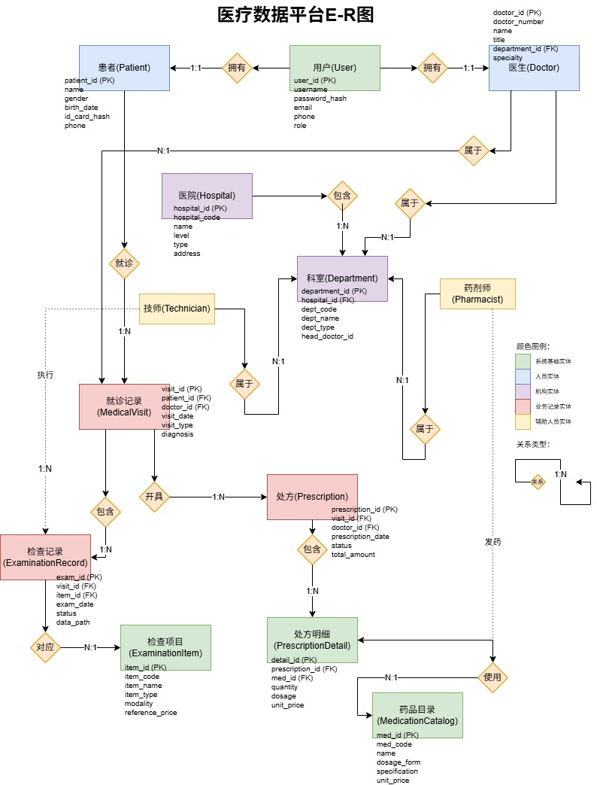

# 医疗数据库管理系统 Medical Database Management System (MDBMS)

## 项目概述
> 一个完整的医疗数据库管理系统，包含患者管理、医疗影像存储、就诊记录、数据分析和可视化等功能。系统采用关系型数据库设计，遵循数据库范式原则，提供完整的数据管理和查询功能。

## 系统架构

### 数据库设计
- 数据库类型：MySQL
- 字符编码：UTF-8

### 技术栈
- 后端：Python 3.8+, MySQL 5.7+
- 数据库驱动：PyMySQL
- 数据处理：pandas, numpy, Faker
- 数据可视化：Matplotlib
- 图片处理：Pillow
- 系统工具：os, sys, pathlib, datetime, json, hashlib, uuid
- 操作系统：Windows 10/11, Linux, macOS

## 项目结构

```
medical_database/
|──database/
|   |──db_connection.py               # 数据库连接类
|   |──connection_pool.py             # 数据库连接池
|   |──db_config.py                   # 数据库配置
|   |──medical_dao.py                 # 医疗数据访问对象 - 业务数据CRUD操作
|   └──__init__.py
|──scripts/
|   |──complex_queries.py             # 高级SQL查询示例
|   |──example_usage.py               # API调用示例
|   |──generate_fake_data.py          # 虚假医疗数据生成器
|   |──image_dao.py                   # 图片CRUD操作
|   |──medical_visualization_demo.py  # 医疗可视化演示
|   |──test_connection.py             # 数据库连接测试
|   |──test_image_storage.py          # 图片存储测试
|   |──verify_data.py                 # 虚假数据验证
|   |──create_image_tables.sql        # 建表SQL（图片相关表）
|   |──create_medical_tables.sql      # 建表SQL（其余表）
|   |──font_test.py                   # 故障测试：中文字符显示问题
|   |──test_upload_issues.py          # 故障测试：图片上传失败
|   └──visualization.py               # 图表生成工具类
|──medical_images/
|   |──originals/                     # 原始图片
|   |──temp/                          # 临时图片
|   |──thumbnails/                    # 缩略图
|──.gitignore
|──E-R.jpg                            # 实体关系图
|──README.md
└──requirements.txt
```

## 快速开始

### 1.环境准备

```
# 安装Python依赖
pip install -r requirements.txt
```

### 2.数据库配置

```python
config = {
    'host': 'localhost',
    'port': 3306,
    'user': 'med_user',
    'password': 'AlphaMeds',
    'database': 'medical_db',
    'charset': 'utf8mb4'
}
```

### 3. 创建数据库表

```sql
--创建数据库
CREATE DATABASE IF NOT EXISTS medical_db CHARACTER SET utf8mb4 COLLATE utf8mb4_unicode_ci;

--运行建表脚本（待建）
mysql -u root -p medical_db < scripts/create_medical_tables.sql
```

## 数据库E-R图

### 实体关系图


### 表关系说明
1. 一对一关系
   - 一个患者只拥有一个用户
   - 一个医生只拥有一个用户
   - 一个药剂师只属于一个科室
   - 一个技师只属于一个科室
   - 一个医疗影像只属于一个影像分类
2. 一对多关系
   - 一个患者可拥有多个就诊记录
   - 一个患者可拥有多个医疗影像
   - 一个医生可拥有多个就诊记录
   - 一个科室可拥有多个医生
   - 一个医院可包含多个科室
   - 一个就诊记录可包含多个检查记录
   - 一个就诊记录可包含多个医疗影像
   - 一个就诊记录可开具多个处方
   - 一个检查记录可包含多个医疗影像
   - 一个处方可包含多个处方明细
   - 一个药剂师可使用多个药品目录
3. 多对多关系
   - 患者通过就诊记录关联医生
   - 技师通过检查记录关联医疗影像

## 数据库表结构

参考《数据实体详细定义.doc》

## 功能演示

### 1. 生成虚假医疗数据

```commandline
python scripts/generate_fake_data.py
```

### 2. 测试图片上传

```commandline
python scripts/test_image_storage.py
```

### 3. 数据可视化

```commandline
python scripts/medical_visualization_demo.py
```

## 可视化功能（待完善）

MDBMS提供多种数据可视化图表：

### 图表类型

- 各科室就诊量统计（分组柱状图）

- 科室就诊统计（双子图对比仪表板）

- 医生就诊量和收入排名Top 10（双轴分组柱状图）

- 月度就诊增长趋势（双轴组合图表）


### 图表输出
- 格式：PNG（300 DPI）
- 保存路径：scripts/visualizations/目录
- 自动生成时间戳文件名

## 医疗图片管理

### 功能特性
- 多模态图片存储
- 图片分类管理
- 缩略图自动生成
- 外键关联约束
- 软删除机制
- 权限控制（公开/私有）

### 图片分类
1. 患者照片
2. 身份证件
3. 检查报告
4. 诊断图片
5. 处方单
6. 化验单
7. 心电图
8. 病历照片
9. 其他

## 故障排除

### 常见问题

1. 数据库连接失败
   - 检查MySQL服务是否运行
   ```commandline
   testing
   ```
   - 验证用户名密码是否正确（参考【快速开始】的【2.数据库配置】）
   - 确认数据库是否存在
   ```commandline
   testing
   ```
2. 外键约束错误
```sql
--临时禁用外键检查
SET FOREIGN_KEY_CHECKS = 0;

--执行操作。。。

--重新启用外键检查
SET FOREIGN_KEY_CHECKS = 1;
```
3. 中文字符显示问题
   - 确保数据库使用utf8mb4编码
   - 调用scripts/font_test.py进行测试
```commandline
python scripts/font_test.py
```
4. 图片上传失败
   - 综合测试
     - 检查存储目录权限
     - 验证患者ID是否存在
     - 检查文件大小限制
```commandline
python test_upload_issues.py
```

## 未来计划

### 短期目标

- [ ] 添加用户认证系统
- [ ] 实现Web界面
- [ ] 添加数据导出功能
- [ ] 优化查询性能

### 长期目标

- [ ] 集成AI图片分析
- [ ] 实现数据同步功能
- [ ] 添加移动端支持
- [ ] 开发API接口

## 贡献指南

1. Fork本仓库
2. 创建功能分支（git checkout -b feature/YourNewFeature）
3. 提交更改（git commit -m 'Add YourNewFeature'）
4. 推动到分支（git push origin feature/YourNewFeature）
5. 开启一个Pull Request

## 联系方式

如有问题或建议，请通过以下方式联系：
- 项目地址：https://github.com/zlynchw/MedicalDBMS-Practice
- 邮箱：zlynchw@gmail.com

---

**注意**：本项目仅为教育及个人练习用途，实际医疗系统需遵循相关法律法规和隐私保护要求。
 
 

